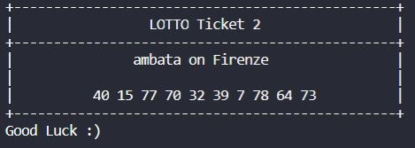
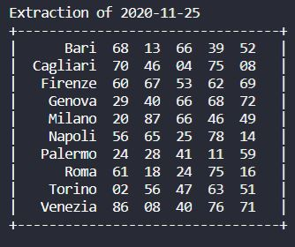
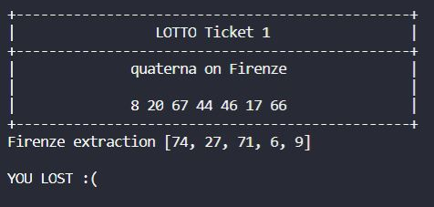
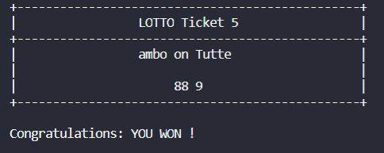

# lotto_lottery
## Level 2: Lotto Fake Extractions

### Introduction
Level 2 of the project requires to use fake extractions and check whether each ticket (generated in Level 1 **Lotto Tickets Generator**) 
resulted in winning or losing.
- a ticket results in **winning** when there is a least amount of matching numbers between the ticket's numbers and the numbers
extracted in its city. (note that for a bet on *Tutte*, namely all cities, the ticket's numbers will be checked against each city's
extraction one by one).
The least amount of matching numbers corresponds to the minumum amount of numbers to play for a specific
bet type. 
For example, a ticket with an *ambata* bet on *Roma* will result in winning if there will be at least 1 matching number
between tickets' numbers and Roma's extraction numbers.  
Instead, a ticket with a *cinquina* bet on *Any* will result in winning if
there will be at least 5 matching numbers between ticket's numbers and all cities' extraction numbers.

Check <https://www.sisal.it/lotto/come-si-gioca> for further information about the rules.

### How to Launch
The entry point *lotto_game.py* script can be launched through command line by specifying the amount of tickets to generate (1-5) for the `n` argument. For example, writing ***python lotto_game.py 3*** will generate a bill of three tickets.  
An optional argument `-v` (or `--verbose`) can be added through command line in order to view instructions about how to play. In this case,
the command to launch the script would be ***python lotto_game.py 3 -v*** or ***python lotto_game.py 3 --verbose***

### Extraction Classes and lotto Package
New *Classes* are used to handle extractions, and can be accessed from *lotto_extraction* and *lotto_numbers* modules inside the 
**lotto package**:

* **`NumbersForExtraction`** (Class)

    it represents a series of numbers which are generated and stored inside an Extraction object.

* **`Extraction`** (Class)

    it represents a full extraction. It uses a dictionary inside its `extraction` attribute in order to store all numbers' sequences.

New methods are added to the *business logic* Class called **`LottoManager`**:
- `check_extraction` method is used to show a full extraction table.
- `is_ticket_winning` method is used to check tickets' numbers against the extraction table, based on a specific city choice.
- `check_results` method is used to show the final ticket result by printing the ticket again and showing the specific extraction
which is relevant in order to establish the result and the winning/losing message.

The previous methods are invoked together in the __str__ method of a `LottoManager` object.

### Output
After launching the script, the program will start constructing each ticket by asking the user all the information about each ticket
(as in Level 1). 
After printing each ticket, the program will ask to show the full extraction table. 
After showing the extraction table, the program will ask to check tickets' results. Tickets will be printed again and their city's
extraction numbers will be shown below them in order to easily check the result. A result message will also be shown.

Output samples (new layouts in Level 2):

*Lotto Ticket*

*Lotto Extraction*

*Lotto Ticket Result: LOST*

*Lotto Ticket Result: WIN*

