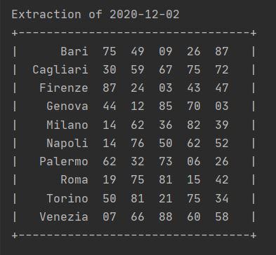
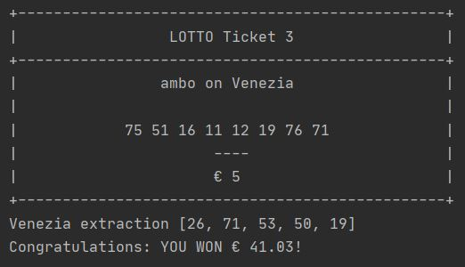

# lotto_lottery
## Level 3: Lotto Calculate Prizes

### Introduction
Level 3 of the project implements a full lotto game by showing if tickets resulted to have won, and for winning
tickets, it will calculate and display the net win 
depending on: amount of numbers - bet type - city - money - matching numbers. 

#### When is a ticket winning?
- a ticket results in **winning** when there is a least amount of matching numbers between the ticket's numbers and the numbers
extracted in its city. (note that for a bet on *Tutte*, namely all cities, the ticket's numbers will be checked against each city's
extraction one by one).
The least amount of matching numbers corresponds to the minimum amount of numbers to play for a specific
bet type. 

Check <https://www.sisal.it/lotto/come-si-gioca> for further information about the rules.

#### How is the net win of a winning ticket computed?
- The computation is done by using a payout table and depends on the placed amount of numbers for 
a specific bet type and city as well as on the amount of matching numbers that resulted from the extraction.
From a gross payout, 8% of taxes will then be subtracted to obtain net payout.  
The net win will be the net payout multiplied by the amount of money that was placed for bet.

Check <https://www.estrazionedellotto.it/prontuario-vincite-lotto> for further information about prizes.

### How to Launch
The entry point *lotto_game.py* script can be launched either:
- through command line, by specifying the amount of tickets to generate (1-5) for the `-n` argument.
 For example, writing ***python lotto_game.py -n 3*** will generate a bill of three tickets.  
An optional argument `-v` (or `--verbose`) can be added through command line in order to view instructions
 about how to play. 
 In this case, the command to launch the script would be
  ***python lotto_game.py -n 3 -v*** or ***python lotto_game.py -n 3 --verbose***
 - in the case of absence of command line arguments, by running the script and entering
  the amount of tickets to generate as an input.

### Classes and lotto Package
The program is built using an OOP approach. 
A series of *classes* inside *modules* of the **lotto package** are used to handle the program.

- **`BetType`**, **`City`**, **`NumbersForTicket`** and **`Money`** represent the
objects upon which a **`Ticket`** instance is created. 
All these classes have their own validation methods.
- **`FullRuota`** and **`Numbers for Extraction`** represent the objects upon which
an **`Extraction`** instance is created.
- **`Prizes`** is the class used to compute prizes of winning tickets based on payout
tables (its class attributes) and a static method which calculates the actual net win
by analyzing a dictionary of winning combinations.
- **`LottoManager`** includes the *business logic* of the program and uses a series
of static and instance methods in order to build tickets, show the extraction table,
compute winning combinations and display final results with eventual wins. 
An instance of this class will have as attributes: a series of Ticket objects (1 to 5) and one 
Extraction object. Both of them will contain all relevant information to make the game work. 
When a `LottoManager` instance gets printed in the *entrypoint* script, the game starts.

### Output
After launching the script, the program will start constructing each ticket by asking the user to enter all information
 about each ticket. 
After printing tickets, the program will ask to show the full extraction table. 
After showing the extraction table, the program will ask to check tickets' results. Tickets will be printed again and their city's
extraction numbers will be shown below them for an easy check. 
A result message will appear for each ticket. 
For winning tickets, net wins and winning combinations will also be shown.

##### Output samples

*Extraction sample*

*Winning Ticket sample*

